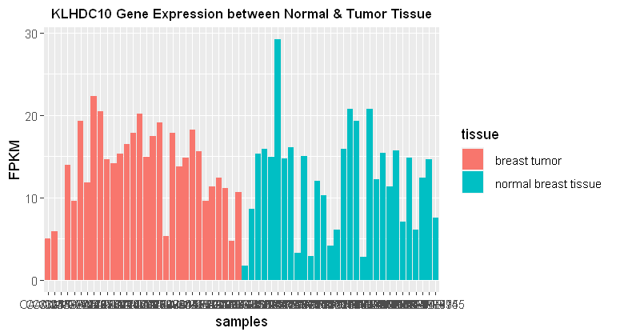
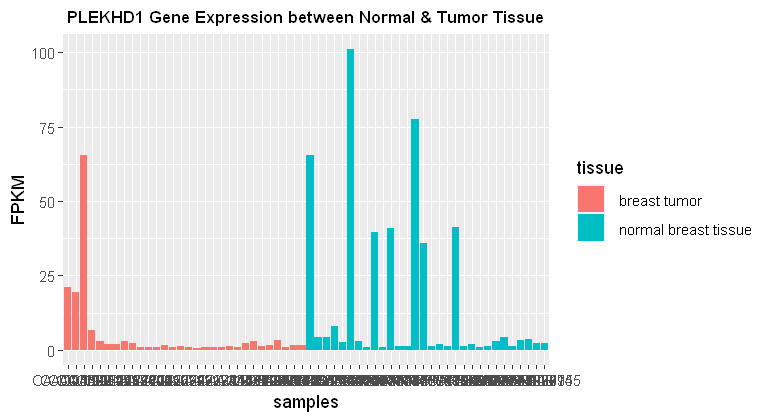
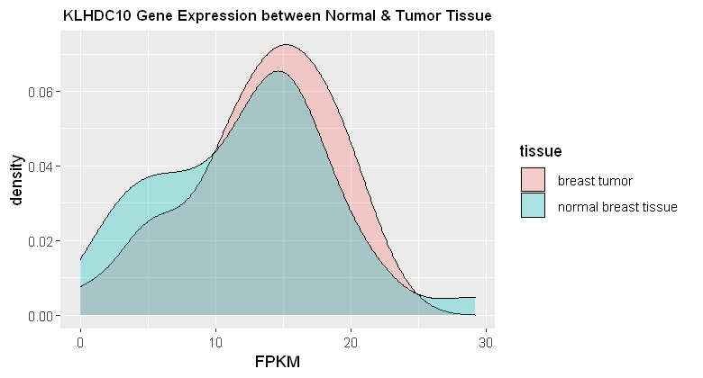
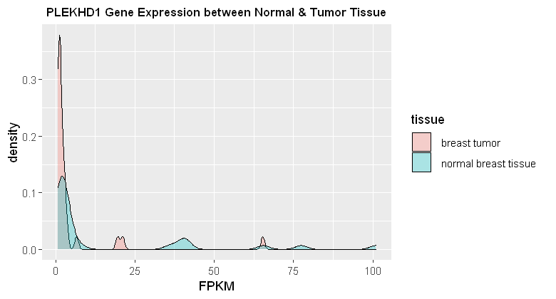
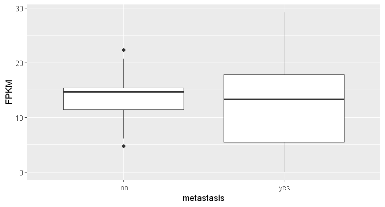
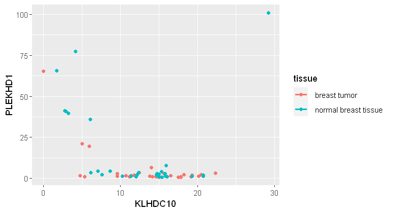
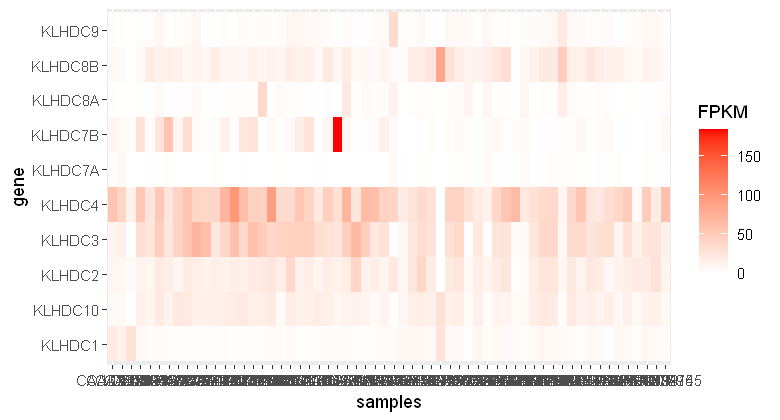
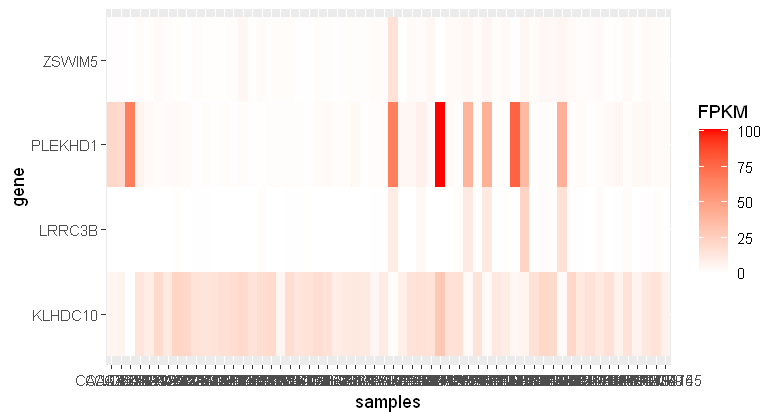

### Gene Expression Data Analysis 
- Accession Number: GSE183947
- Data Source: NCBI, GEO
- Data Type: RNA-Seq Data
- Original reads of RNA sequencing data were normalized as FPKM data.


```R
# Load required packages 
library(dplyr)
library(tidyverse)
library(GEOquery)
library(R.utils)
library(ggplot2)
library(repr)
```


```R
# Unzip the .gz data file 
gunzip("GSE183947_fpkm.csv.gz")
```


    Error in decompressFile.default(filename = filename, ..., ext = ext, FUN = FUN): No such file: GSE183947_fpkm.csv.gz
    Traceback:
    

    1. gunzip("GSE183947_fpkm.csv.gz")

    2. gunzip.default("GSE183947_fpkm.csv.gz")

    3. decompressFile(filename = filename, ..., ext = ext, FUN = FUN)

    4. decompressFile.default(filename = filename, ..., ext = ext, FUN = FUN)

    5. stop("No such file: ", filename)


```R
# Read the Data 
data <- read.csv(file = "GSE183947_fpkm.csv")
```


```R
head(data, 10)
```


<table>
<thead><tr><th scope=col>X</th><th scope=col>CA.102548</th><th scope=col>CA.104338</th><th scope=col>CA.105094</th><th scope=col>CA.109745</th><th scope=col>CA.1906415</th><th scope=col>CA.1912627</th><th scope=col>CA.1924346</th><th scope=col>CA.1926760</th><th scope=col>CA.1927842</th><th scope=col>...</th><th scope=col>CAP.2040686</th><th scope=col>CAP.2046297</th><th scope=col>CAP.2046641</th><th scope=col>CAP.348981</th><th scope=col>CAP.354300</th><th scope=col>CAP.359448</th><th scope=col>CAP.94377</th><th scope=col>CAP.98389</th><th scope=col>CAP.98475</th><th scope=col>CAP.99145</th></tr></thead>
<tbody>
	<tr><td>TSPAN6  </td><td> 0.93   </td><td> 1.97   </td><td> 0.00   </td><td> 5.45   </td><td> 4.52   </td><td> 4.75   </td><td> 3.96   </td><td> 3.58   </td><td> 6.41   </td><td>...     </td><td> 6.66   </td><td> 8.35   </td><td> 8.94   </td><td> 6.33   </td><td> 5.94   </td><td> 6.35   </td><td> 3.74   </td><td> 4.84   </td><td>10.46   </td><td> 4.54   </td></tr>
	<tr><td>TNMD    </td><td> 0.00   </td><td> 0.00   </td><td> 0.00   </td><td> 0.00   </td><td> 0.00   </td><td> 0.00   </td><td> 0.00   </td><td> 0.23   </td><td> 0.39   </td><td>...     </td><td> 0.12   </td><td> 0.17   </td><td> 1.08   </td><td> 0.29   </td><td> 0.00   </td><td> 0.07   </td><td> 9.19   </td><td> 1.18   </td><td> 0.09   </td><td> 0.39   </td></tr>
	<tr><td>DPM1    </td><td> 0.00   </td><td> 0.43   </td><td> 0.00   </td><td> 3.43   </td><td> 8.45   </td><td> 8.53   </td><td> 7.80   </td><td> 7.62   </td><td> 6.40   </td><td>...     </td><td> 4.93   </td><td> 7.47   </td><td> 5.72   </td><td> 4.96   </td><td> 9.28   </td><td> 9.15   </td><td> 4.77   </td><td> 3.75   </td><td> 7.31   </td><td> 2.77   </td></tr>
	<tr><td>SCYL3   </td><td> 5.78   </td><td> 5.17   </td><td> 8.76   </td><td> 4.58   </td><td> 7.20   </td><td> 6.03   </td><td> 9.05   </td><td> 5.37   </td><td> 5.92   </td><td>...     </td><td> 8.02   </td><td> 6.00   </td><td> 5.28   </td><td> 4.98   </td><td> 4.45   </td><td> 7.00   </td><td> 4.14   </td><td> 5.51   </td><td> 7.45   </td><td> 2.33   </td></tr>
	<tr><td>C1orf112</td><td> 2.83   </td><td> 6.26   </td><td> 3.37   </td><td> 6.24   </td><td> 5.16   </td><td>13.69   </td><td> 6.69   </td><td> 5.28   </td><td> 7.65   </td><td>...     </td><td> 7.91   </td><td> 4.61   </td><td> 8.35   </td><td> 9.84   </td><td> 7.68   </td><td> 5.62   </td><td> 2.81   </td><td> 7.08   </td><td> 7.28   </td><td> 5.39   </td></tr>
	<tr><td>FGR     </td><td> 4.80   </td><td> 1.83   </td><td> 0.00   </td><td> 4.23   </td><td>15.87   </td><td> 8.56   </td><td>13.28   </td><td>12.27   </td><td> 5.58   </td><td>...     </td><td> 6.99   </td><td> 6.16   </td><td>13.27   </td><td>19.33   </td><td> 2.89   </td><td>40.13   </td><td>10.53   </td><td> 9.00   </td><td> 4.45   </td><td>11.42   </td></tr>
	<tr><td>CFH     </td><td> 1.37   </td><td> 1.78   </td><td> 0.00   </td><td> 2.59   </td><td> 9.21   </td><td> 8.22   </td><td>15.64   </td><td> 4.06   </td><td> 5.52   </td><td>...     </td><td> 9.07   </td><td>28.20   </td><td>14.57   </td><td>14.89   </td><td>15.49   </td><td>31.55   </td><td>21.43   </td><td> 5.72   </td><td>25.26   </td><td> 3.71   </td></tr>
	<tr><td>FUCA2   </td><td>21.92   </td><td>10.48   </td><td> 0.00   </td><td>23.78   </td><td>14.95   </td><td> 7.11   </td><td>14.03   </td><td>19.77   </td><td>18.31   </td><td>...     </td><td>13.40   </td><td>10.57   </td><td>22.14   </td><td>31.01   </td><td> 6.84   </td><td>11.90   </td><td> 2.75   </td><td> 7.73   </td><td>10.34   </td><td> 9.61   </td></tr>
	<tr><td>GCLC    </td><td>34.16   </td><td>25.12   </td><td>21.77   </td><td>16.48   </td><td>18.19   </td><td>20.94   </td><td>13.76   </td><td>25.24   </td><td>21.19   </td><td>...     </td><td>18.29   </td><td>29.94   </td><td>17.30   </td><td>18.24   </td><td>21.21   </td><td>22.40   </td><td>39.71   </td><td>25.57   </td><td>26.17   </td><td>16.96   </td></tr>
	<tr><td>NFYA    </td><td> 0.70   </td><td> 1.13   </td><td> 0.00   </td><td>10.72   </td><td>17.50   </td><td>13.00   </td><td> 9.90   </td><td>20.28   </td><td>19.21   </td><td>...     </td><td>11.18   </td><td> 9.79   </td><td>15.31   </td><td>16.60   </td><td>18.17   </td><td>19.34   </td><td>11.55   </td><td>21.27   </td><td> 6.27   </td><td> 7.62   </td></tr>
</tbody>
</table>


```R
# Using 'dim' - Get number of rows and columns
# Each row represents one gene and each column represents one sample
# Here we have 20246 gene and 60 sample (30 normal and 30 tumor)
dim (data)
```


<ol class=list-inline>
	<li>20246</li>
	<li>61</li>
</ol>


```R
# Get Metadata 
gse <- getGEO(GEO = 'GSE183947', GSEMatrix = TRUE)
```

    Found 1 file(s)
    GSE183947_series_matrix.txt.gz
    Using locally cached version: C:\Users\USER\AppData\Local\Temp\RtmpaCl0k4/GSE183947_series_matrix.txt.gz
    
    -- Column specification --------------------------------------------------------
    cols(
      .default = col_character()
    )
    i Use `spec()` for the full column specifications.
    
    Using locally cached version of GPL11154 found here:
    C:\Users\USER\AppData\Local\Temp\RtmpaCl0k4/GPL11154.soft 
    


```R
gse
```


    $GSE183947_series_matrix.txt.gz
    ExpressionSet (storageMode: lockedEnvironment)
    assayData: 0 features, 60 samples 
      element names: exprs 
    protocolData: none
    phenoData
      sampleNames: GSM5574685 GSM5574686 ... GSM5574744 (60 total)
      varLabels: title geo_accession ... tissue:ch1 (41 total)
      varMetadata: labelDescription
    featureData: none
    experimentData: use 'experimentData(object)'
      pubMedIds: 35046993 
    Annotation: GPL11154 
    


```R
metadata <- pData(phenoData(gse[[1]]))
head(metadata)
```


<table>
<thead><tr><th></th><th scope=col>title</th><th scope=col>geo_accession</th><th scope=col>status</th><th scope=col>submission_date</th><th scope=col>last_update_date</th><th scope=col>type</th><th scope=col>channel_count</th><th scope=col>source_name_ch1</th><th scope=col>organism_ch1</th><th scope=col>characteristics_ch1</th><th scope=col>...</th><th scope=col>instrument_model</th><th scope=col>library_selection</th><th scope=col>library_source</th><th scope=col>library_strategy</th><th scope=col>relation</th><th scope=col>relation.1</th><th scope=col>supplementary_file_1</th><th scope=col>donor:ch1</th><th scope=col>metastasis:ch1</th><th scope=col>tissue:ch1</th></tr></thead>
<tbody>
	<tr><th scope=row>GSM5574685</th><td>tumor rep1                                                    </td><td>GSM5574685                                                    </td><td>Public on Sep 15 2021                                         </td><td>Sep 11 2021                                                   </td><td>Sep 15 2021                                                   </td><td>SRA                                                           </td><td>1                                                             </td><td>breast                                                        </td><td>Homo sapiens                                                  </td><td>tissue: breast tumor                                          </td><td>...                                                           </td><td>Illumina HiSeq 2000                                           </td><td>cDNA                                                          </td><td>transcriptomic                                                </td><td>RNA-Seq                                                       </td><td>BioSample: https://www.ncbi.nlm.nih.gov/biosample/SAMN21395376</td><td>SRA: https://www.ncbi.nlm.nih.gov/sra?term=SRX12143676        </td><td>NONE                                                          </td><td>102548                                                        </td><td>yes                                                           </td><td>breast tumor                                                  </td></tr>
	<tr><th scope=row>GSM5574686</th><td>tumor rep2                                                    </td><td>GSM5574686                                                    </td><td>Public on Sep 15 2021                                         </td><td>Sep 11 2021                                                   </td><td>Sep 15 2021                                                   </td><td>SRA                                                           </td><td>1                                                             </td><td>breast                                                        </td><td>Homo sapiens                                                  </td><td>tissue: breast tumor                                          </td><td>...                                                           </td><td>Illumina HiSeq 2000                                           </td><td>cDNA                                                          </td><td>transcriptomic                                                </td><td>RNA-Seq                                                       </td><td>BioSample: https://www.ncbi.nlm.nih.gov/biosample/SAMN21395377</td><td>SRA: https://www.ncbi.nlm.nih.gov/sra?term=SRX12143617        </td><td>NONE                                                          </td><td>104338                                                        </td><td>yes                                                           </td><td>breast tumor                                                  </td></tr>
	<tr><th scope=row>GSM5574687</th><td>tumor rep3                                                    </td><td>GSM5574687                                                    </td><td>Public on Sep 15 2021                                         </td><td>Sep 11 2021                                                   </td><td>Sep 15 2021                                                   </td><td>SRA                                                           </td><td>1                                                             </td><td>breast                                                        </td><td>Homo sapiens                                                  </td><td>tissue: breast tumor                                          </td><td>...                                                           </td><td>Illumina HiSeq 2000                                           </td><td>cDNA                                                          </td><td>transcriptomic                                                </td><td>RNA-Seq                                                       </td><td>BioSample: https://www.ncbi.nlm.nih.gov/biosample/SAMN21395378</td><td>SRA: https://www.ncbi.nlm.nih.gov/sra?term=SRX12143618        </td><td>NONE                                                          </td><td>105094                                                        </td><td>yes                                                           </td><td>breast tumor                                                  </td></tr>
	<tr><th scope=row>GSM5574688</th><td>tumor rep4                                                    </td><td>GSM5574688                                                    </td><td>Public on Sep 15 2021                                         </td><td>Sep 11 2021                                                   </td><td>Sep 15 2021                                                   </td><td>SRA                                                           </td><td>1                                                             </td><td>breast                                                        </td><td>Homo sapiens                                                  </td><td>tissue: breast tumor                                          </td><td>...                                                           </td><td>Illumina HiSeq 2000                                           </td><td>cDNA                                                          </td><td>transcriptomic                                                </td><td>RNA-Seq                                                       </td><td>BioSample: https://www.ncbi.nlm.nih.gov/biosample/SAMN21395379</td><td>SRA: https://www.ncbi.nlm.nih.gov/sra?term=SRX12143619        </td><td>NONE                                                          </td><td>109745                                                        </td><td>no                                                            </td><td>breast tumor                                                  </td></tr>
	<tr><th scope=row>GSM5574689</th><td>tumor rep5                                                    </td><td>GSM5574689                                                    </td><td>Public on Sep 15 2021                                         </td><td>Sep 11 2021                                                   </td><td>Sep 15 2021                                                   </td><td>SRA                                                           </td><td>1                                                             </td><td>breast                                                        </td><td>Homo sapiens                                                  </td><td>tissue: breast tumor                                          </td><td>...                                                           </td><td>Illumina HiSeq 2000                                           </td><td>cDNA                                                          </td><td>transcriptomic                                                </td><td>RNA-Seq                                                       </td><td>BioSample: https://www.ncbi.nlm.nih.gov/biosample/SAMN21394912</td><td>SRA: https://www.ncbi.nlm.nih.gov/sra?term=SRX12143620        </td><td>NONE                                                          </td><td>1906415                                                       </td><td>no                                                            </td><td>breast tumor                                                  </td></tr>
	<tr><th scope=row>GSM5574690</th><td>tumor rep6                                                    </td><td>GSM5574690                                                    </td><td>Public on Sep 15 2021                                         </td><td>Sep 11 2021                                                   </td><td>Sep 15 2021                                                   </td><td>SRA                                                           </td><td>1                                                             </td><td>breast                                                        </td><td>Homo sapiens                                                  </td><td>tissue: breast tumor                                          </td><td>...                                                           </td><td>Illumina HiSeq 2000                                           </td><td>cDNA                                                          </td><td>transcriptomic                                                </td><td>RNA-Seq                                                       </td><td>BioSample: https://www.ncbi.nlm.nih.gov/biosample/SAMN21394913</td><td>SRA: https://www.ncbi.nlm.nih.gov/sra?term=SRX12143621        </td><td>NONE                                                          </td><td>1912627                                                       </td><td>yes                                                           </td><td>breast tumor                                                  </td></tr>
</tbody>
</table>


```R
# Modify the metadata for convenient analysis 
metadata_modified <- metadata %>%
  select(1,10,11,17) %>%
  rename(tissue = characteristics_ch1, 
         metastasis = characteristics_ch1.1) %>%
  mutate(tissue = gsub("tissue:", "", tissue,),
         metastasis = gsub("metastasis:", "", metastasis))
```


```R
head(metadata_modified, 10)
```


<table>
<thead><tr><th></th><th scope=col>title</th><th scope=col>tissue</th><th scope=col>metastasis</th><th scope=col>description</th></tr></thead>
<tbody>
	<tr><th scope=row>GSM5574685</th><td>tumor rep1   </td><td> breast tumor</td><td> yes         </td><td>CA.102548    </td></tr>
	<tr><th scope=row>GSM5574686</th><td>tumor rep2   </td><td> breast tumor</td><td> yes         </td><td>CA.104338    </td></tr>
	<tr><th scope=row>GSM5574687</th><td>tumor rep3   </td><td> breast tumor</td><td> yes         </td><td>CA.105094    </td></tr>
	<tr><th scope=row>GSM5574688</th><td>tumor rep4   </td><td> breast tumor</td><td> no          </td><td>CA.109745    </td></tr>
	<tr><th scope=row>GSM5574689</th><td>tumor rep5   </td><td> breast tumor</td><td> no          </td><td>CA.1906415   </td></tr>
	<tr><th scope=row>GSM5574690</th><td>tumor rep6   </td><td> breast tumor</td><td> yes         </td><td>CA.1912627   </td></tr>
	<tr><th scope=row>GSM5574691</th><td>tumor rep7   </td><td> breast tumor</td><td> no          </td><td>CA.1924346   </td></tr>
	<tr><th scope=row>GSM5574692</th><td>tumor rep8   </td><td> breast tumor</td><td> no          </td><td>CA.1926760   </td></tr>
	<tr><th scope=row>GSM5574693</th><td>tumor rep9   </td><td> breast tumor</td><td> yes         </td><td>CA.1927842   </td></tr>
	<tr><th scope=row>GSM5574694</th><td>tumor rep10  </td><td> breast tumor</td><td> no          </td><td>CA.1933414   </td></tr>
</tbody>
</table>


```R
# Reshaping the data 
data_long <- data %>%
  rename(gene = X) %>%
  gather(key = 'samples', value = 'FPKM', -gene)
```


```R
head(data_long, 10)
```


<table>
<thead><tr><th scope=col>gene</th><th scope=col>samples</th><th scope=col>FPKM</th></tr></thead>
<tbody>
	<tr><td>TSPAN6   </td><td>CA.102548</td><td> 0.93    </td></tr>
	<tr><td>TNMD     </td><td>CA.102548</td><td> 0.00    </td></tr>
	<tr><td>DPM1     </td><td>CA.102548</td><td> 0.00    </td></tr>
	<tr><td>SCYL3    </td><td>CA.102548</td><td> 5.78    </td></tr>
	<tr><td>C1orf112 </td><td>CA.102548</td><td> 2.83    </td></tr>
	<tr><td>FGR      </td><td>CA.102548</td><td> 4.80    </td></tr>
	<tr><td>CFH      </td><td>CA.102548</td><td> 1.37    </td></tr>
	<tr><td>FUCA2    </td><td>CA.102548</td><td>21.92    </td></tr>
	<tr><td>GCLC     </td><td>CA.102548</td><td>34.16    </td></tr>
	<tr><td>NFYA     </td><td>CA.102548</td><td> 0.70    </td></tr>
</tbody>
</table>


```R
# Join dataframes = data_logn + metadata_modified 
data_long_modified <- data_long %>% 
  left_join(., metadata_modified, by = c("samples" = "description")) 
# (. indicates to take previous command then excute the current code)
```


```R
head(data_long_modified, 10)
```


<table>
<thead><tr><th scope=col>gene</th><th scope=col>samples</th><th scope=col>FPKM</th><th scope=col>title</th><th scope=col>tissue</th><th scope=col>metastasis</th></tr></thead>
<tbody>
	<tr><td>TSPAN6       </td><td>CA.102548    </td><td> 0.93        </td><td>tumor rep1   </td><td> breast tumor</td><td> yes         </td></tr>
	<tr><td>TNMD         </td><td>CA.102548    </td><td> 0.00        </td><td>tumor rep1   </td><td> breast tumor</td><td> yes         </td></tr>
	<tr><td>DPM1         </td><td>CA.102548    </td><td> 0.00        </td><td>tumor rep1   </td><td> breast tumor</td><td> yes         </td></tr>
	<tr><td>SCYL3        </td><td>CA.102548    </td><td> 5.78        </td><td>tumor rep1   </td><td> breast tumor</td><td> yes         </td></tr>
	<tr><td>C1orf112     </td><td>CA.102548    </td><td> 2.83        </td><td>tumor rep1   </td><td> breast tumor</td><td> yes         </td></tr>
	<tr><td>FGR          </td><td>CA.102548    </td><td> 4.80        </td><td>tumor rep1   </td><td> breast tumor</td><td> yes         </td></tr>
	<tr><td>CFH          </td><td>CA.102548    </td><td> 1.37        </td><td>tumor rep1   </td><td> breast tumor</td><td> yes         </td></tr>
	<tr><td>FUCA2        </td><td>CA.102548    </td><td>21.92        </td><td>tumor rep1   </td><td> breast tumor</td><td> yes         </td></tr>
	<tr><td>GCLC         </td><td>CA.102548    </td><td>34.16        </td><td>tumor rep1   </td><td> breast tumor</td><td> yes         </td></tr>
	<tr><td>NFYA         </td><td>CA.102548    </td><td> 0.70        </td><td>tumor rep1   </td><td> breast tumor</td><td> yes         </td></tr>
</tbody>
</table>


```R
# Explore data for all KLHDC gene 
data_long_modified %>%
  filter(gene == 'KLHDC1' | gene == 'KLHDC4' | gene == 'KLHDC3' | gene == 'KLHDC10' | gene == 'KLHDC7B' | gene == 'KLHDC9' | 
         gene == 'KLHDC8A' | gene == 'KLHDC2' | gene == 'KLHDC7A' | gene == 'KLHDC8B') %>%
  group_by(gene, tissue) %>%
  summarise(mean_FPKM = mean(FPKM),
            median_FPKM = median(FPKM)) %>%
  # lets arrange theme in descending order (high to low value)
  arrange(-mean_FPKM)
```

    `summarise()` has grouped output by 'gene'. You can override using the `.groups` argument.
    


<table>
<thead><tr><th scope=col>gene</th><th scope=col>tissue</th><th scope=col>mean_FPKM</th><th scope=col>median_FPKM</th></tr></thead>
<tbody>
	<tr><td>KLHDC4               </td><td> breast tumor        </td><td>46.813000            </td><td>43.345               </td></tr>
	<tr><td>KLHDC3               </td><td> breast tumor        </td><td>38.688000            </td><td>40.375               </td></tr>
	<tr><td>KLHDC4               </td><td> normal breast tissue</td><td>32.295667            </td><td>34.125               </td></tr>
	<tr><td>KLHDC3               </td><td> normal breast tissue</td><td>20.956667            </td><td>25.280               </td></tr>
	<tr><td>KLHDC8B              </td><td> normal breast tissue</td><td>17.989667            </td><td>14.045               </td></tr>
	<tr><td>KLHDC7B              </td><td> breast tumor        </td><td>17.280667            </td><td> 6.830               </td></tr>
	<tr><td>KLHDC2               </td><td> normal breast tissue</td><td>16.583000            </td><td>18.520               </td></tr>
	<tr><td>KLHDC2               </td><td> breast tumor        </td><td>16.091333            </td><td>15.475               </td></tr>
	<tr><td>KLHDC10              </td><td> breast tumor        </td><td>13.477000            </td><td>14.385               </td></tr>
	<tr><td>KLHDC10              </td><td> normal breast tissue</td><td>12.243667            </td><td>13.535               </td></tr>
	<tr><td>KLHDC8B              </td><td> breast tumor        </td><td>10.734667            </td><td> 9.940               </td></tr>
	<tr><td>KLHDC1               </td><td> normal breast tissue</td><td> 6.225000            </td><td> 5.650               </td></tr>
	<tr><td>KLHDC9               </td><td> normal breast tissue</td><td> 5.231000            </td><td> 3.430               </td></tr>
	<tr><td>KLHDC1               </td><td> breast tumor        </td><td> 4.877667            </td><td> 3.225               </td></tr>
	<tr><td>KLHDC8A              </td><td> breast tumor        </td><td> 3.530667            </td><td> 1.240               </td></tr>
	<tr><td>KLHDC9               </td><td> breast tumor        </td><td> 3.317000            </td><td> 2.960               </td></tr>
	<tr><td>KLHDC8A              </td><td> normal breast tissue</td><td> 3.134000            </td><td> 1.460               </td></tr>
	<tr><td>KLHDC7B              </td><td> normal breast tissue</td><td> 2.646000            </td><td> 1.925               </td></tr>
	<tr><td>KLHDC7A              </td><td> normal breast tissue</td><td> 1.325000            </td><td> 0.825               </td></tr>
	<tr><td>KLHDC7A              </td><td> breast tumor        </td><td> 0.668000            </td><td> 0.110               </td></tr>
</tbody>
</table>


```R
# Explore data for all KLHDC gene 
data_long_modified %>%
  filter(gene == 'KLHDC10' | gene == 'PLEKHD1' | gene == 'ZSWIM5' | gene == 'LRRC3B') %>%
  group_by(gene, tissue) %>%
  summarise(mean_FPKM = mean(FPKM),
            median_FPKM = median(FPKM)) %>%
  # lets arrange theme in descending order (high to low value)
  arrange(-mean_FPKM)
```

    `summarise()` has grouped output by 'gene'. You can override using the `.groups` argument.
    


<table>
<thead><tr><th scope=col>gene</th><th scope=col>tissue</th><th scope=col>mean_FPKM</th><th scope=col>median_FPKM</th></tr></thead>
<tbody>
	<tr><td>PLEKHD1              </td><td> normal breast tissue</td><td>15.273000            </td><td> 2.725               </td></tr>
	<tr><td>KLHDC10              </td><td> breast tumor        </td><td>13.477000            </td><td>14.385               </td></tr>
	<tr><td>KLHDC10              </td><td> normal breast tissue</td><td>12.243667            </td><td>13.535               </td></tr>
	<tr><td>PLEKHD1              </td><td> breast tumor        </td><td> 5.141667            </td><td> 1.530               </td></tr>
	<tr><td>LRRC3B               </td><td> normal breast tissue</td><td> 3.013667            </td><td> 0.545               </td></tr>
	<tr><td>ZSWIM5               </td><td> normal breast tissue</td><td> 2.909667            </td><td> 2.575               </td></tr>
	<tr><td>ZSWIM5               </td><td> breast tumor        </td><td> 1.253667            </td><td> 1.115               </td></tr>
	<tr><td>LRRC3B               </td><td> breast tumor        </td><td> 0.166000            </td><td> 0.000               </td></tr>
</tbody>
</table>


```R
# Size of the plot
options(repr.plot.width =6.5, repr.plot.height =3.5)
```


```R
# Data Visualization 
# Barplot 
data_long_modified %>%
  filter(gene == 'KLHDC10') %>%
  ggplot(., aes(x = samples, y = FPKM, fill = tissue)) +
  geom_col() +
  ggtitle("KLHDC10 Gene Expression between Normal & Tumor Tissue") +
  theme(plot.title = element_text(
          size = 10,       
          face = "bold",    
          hjust = 0.5 ))
```


    

    


```R
# Data Visualization 
# Barplot 
data_long_modified %>%
  filter(gene == 'PLEKHD1') %>%
  ggplot(., aes(x = samples, y = FPKM, fill = tissue)) +
  geom_col() +
  ggtitle("PLEKHD1 Gene Expression between Normal & Tumor Tissue") +
  theme(plot.title = element_text(
          size = 10,       
          face = "bold",    
          hjust = 0.5 ))
```


    

    


```R
# Density 
data_long_modified %>%
  filter(gene == 'KLHDC10') %>%
  ggplot(., aes(x = FPKM, fill = tissue)) +
  geom_density(alpha = 0.3) +
  ggtitle("KLHDC10 Gene Expression between Normal & Tumor Tissue") +
  theme(plot.title = element_text(
          size = 10,       
          face = "bold",    
          hjust = 0.5 ))
```


    

    


```R
# Density 
data_long_modified %>%
  filter(gene == 'PLEKHD1') %>%
  ggplot(., aes(x = FPKM, fill = tissue)) +
  geom_density(alpha = 0.3) +
  ggtitle("PLEKHD1 Gene Expression between Normal & Tumor Tissue") +
  theme(plot.title = element_text(
          size = 10,       
          face = "bold",    
          hjust = 0.5 ))
```


    

    


```R
# boxplot 
data_long_modified %>%
  filter(gene == 'KLHDC10') %>%
  ggplot(., aes(x = metastasis, y = FPKM)) +
  geom_boxplot()
```


    

    


```R
# scatterplot
data_long_modified %>%
  filter(gene == 'KLHDC10' | gene == 'PLEKHD1') %>%
  spread(key = gene, value = FPKM) %>%
  ggplot(., aes(x = KLHDC10, y = PLEKHD1, color = tissue)) +
  geom_point() +
  geom_smooth(method = 'lm', se = FALSE)
```

    `geom_smooth()` using formula 'y ~ x'
    Warning message:
    "Computation failed in `stat_smooth()`:
    there is no package called 'lattice'"


    

    


```R
# Heatmap 
data_long_modified %>%
  filter(gene == 'KLHDC1' | gene == 'KLHDC4' | gene == 'KLHDC3' | gene == 'KLHDC10' | gene == 'KLHDC7B' | gene == 'KLHDC9' | 
         gene == 'KLHDC8A' | gene == 'KLHDC2' | gene == 'KLHDC7A' | gene == 'KLHDC8B') %>%
  ggplot(., aes(x = samples, y = gene, fill = FPKM)) +
  geom_tile() +
  scale_fill_gradient(low = "white", high = "red")
```


    

    


```R
# Heatmap 
data_long_modified %>%
  filter(gene == 'KLHDC10' | gene == 'PLEKHD1' | gene == 'ZSWIM5' | gene == 'LRRC3B' ) %>%
  ggplot(., aes(x = samples, y = gene, fill = FPKM)) +
  geom_tile() +
  scale_fill_gradient(low = "white", high = "red")
```


    

    


```R

```
